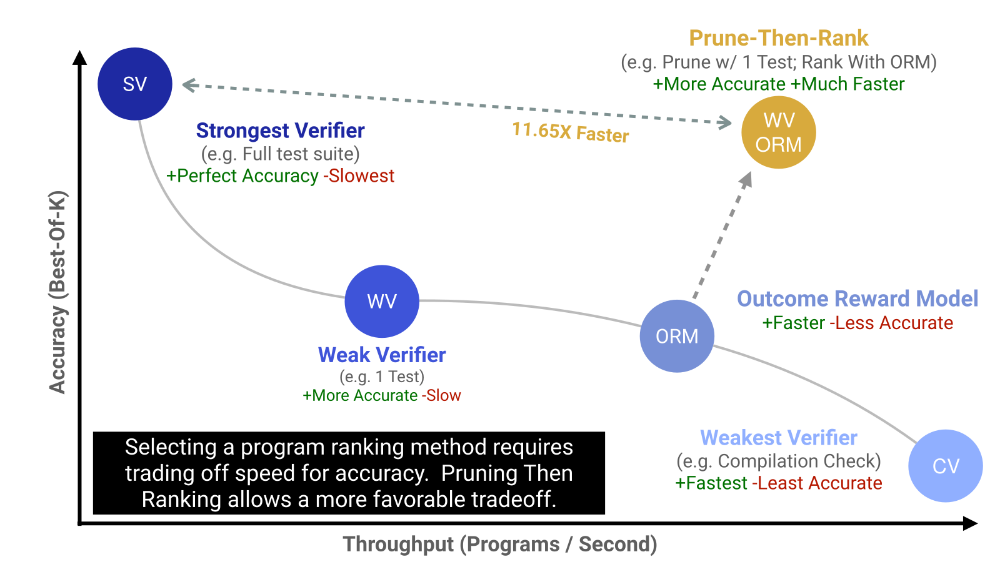

# Reward Models Enable Scalable Code Verification by Trading Accuracy for Throughput



## Overview

This repository implements a scalable approach to code verification using outcome reward models (ORMs) and efficient pruning strategies. The system enables high-throughput code verification by trading off accuracy through a novel filtering approach. Key features include:

- Training and evaluating code verification models
- Multiple scoring methods (binary logit, classification, reward modeling)
- Comprehensive evaluation across multiple benchmark datasets
- Efficient pruning strategies for scalable verification
- Support for various transformer architectures

## Repository Structure

```
.
├── configs/             # Configuration files for experiments and evaluation
│   └── evaluation/      # Evaluation configs for running base model
│   └── experiments/     # Full experiment configs
│   └── model/           # Different architectures configs
│   └── preprocessing/   # Prompting configs
│   └── scoring/         # Configurations for different scoring methods.
│   └── suite/           # Suite configurations for evaluation
│   └── trainer/         # Training configs
├── scripts/           
│   ├── data/            # Data processing and generation
│   └── exec_trials/     # Execution trial implementations
├── src/               
│   ├── evaluation/      # Evaluation suite and benchmarks
│   ├── modeling.py      # Model architectures
│   ├── preprocessing.py # Data preparation
│   ├── scoring.py       # Solution scoring
│   └── training/        # Training pipeline
└── figs/                # Project figures and diagrams
```

For detailed information about specific components:
- [Data Processing Documentation](scripts/data/README.md)
- [Execution Trials Documentation](scripts/exec_trials/README.md)
- [Source Code Documentation](src/README.md)

# Installation

## Clone the repository

```sh
git clone https://github.com/SprocketLab/orm-code-verifier.git
cd orm-code-verifier
```

## Install Require Packages

### Training And Evaluation

The dependencies for training and evaluation can be installed with:

```sh
pip install -r requirements.txt
```

Additional Commands to run:
```sh
git clone https://github.com/bigcode-project/bigcode-evaluation-harness.git scratch/bigcode --depth=1
cd scratch/bigcode 
pip install -e .
cd ..
pip install flash-attn --no-build-isolation
```
# Quick Run

## 1. Preprocess The Training Data
```sh
python scripts/make_train_data.py \
    --num_proc=4 \
    --black_format \
    --require_pf
```

This will format the training data and save it to disk so it can be loaded faster. Then you can run:
```sh
bash scripts/experiment.sh rm_qsol qwen25-coder-1_5b {DEVICE} {SEED} \
    --precision=bf16 \
    --num_workers=4 \
    --real_batch_size=64 \
    --overwrite \
    --batch_size=2 \
    --val_batch_tokens=12000 \
    gradient_checkpointing=True \
    --eval_batch_tokens=200000
```
Notes:
* `rm_qsol` is the experiment to run, you can look at [the other experiment configs for different setups](configs/experiments/). `qsol` is just the formatting setup for the sequences located in [the preprocessing config directory.](/configs/preprocessing/)
* We use the seeds of 1, 1999, and 2024 for our experiments in the paper.

# Execution Trials

The system supports three types of execution trials for comprehensive evaluation:

1. **Execution Timing**: Measure performance and resource usage
2. **Syntax Validation**: Check code correctness
3. **Linting Checks**: Ensure code quality

To run the strongest verifier:

```sh
bash scripts/exec_trials/trial.sh code_contests qc-inst-7b t1.0_n128 32 outputs/ftp32_code_contets 5
```

Key configuration parameters:
- Temperature and sample size (e.g., t1.0_n128 = temperature 1.0, 128 samples)
- Number of parallel workers
- Test execution timeouts
- Maximum tests per problem

For detailed configuration options and security considerations, see the [Execution Trials Documentation](scripts/exec_trials/README.md).

## Evaluation

The system provides multiple evaluation configurations, each serving different verification purposes:

- **Base** ([zero_shot](configs/suite/zero_shot.yaml)): Basic verification without additional checks
- **Syntax** ([zero_shot_syntax](configs/suite/zero_shot_syntax.yaml)): Focuses on syntactic correctness
- **Lint** ([zero_shot_lint](configs/suite/zero_shot_lint.yaml)): Enforces code style and quality
- **N Test**:
  - [1 Test](configs/suite/zero_shot_3s1t.yaml): Quick verification with minimal testing
  - [3 Tests](configs/suite/zero_shot_3s3t.yaml): Balanced verification approach
  - [10 Tests](configs/suite/zero_shot_3s10t.yaml): Thorough verification with extensive testing

To run evaluation with a specific configuration:

```sh
accelerate launch \
    --gpu_ids 0 \
    --mixed_precision=bf16 \
    --config_file=configs/accelerate.yaml \
    evaluate_model.py \
    --precision=bf16 \
    --device=0 \
    -group={WANB_GROUP_NAME} \
    --overwrite \
    --max_tokens_per_batch=6000 \
    --seed={SEED} \
    --num_workers=16 \
    qc-inst-7b \
    t1.0_n128 \
    checkpoint \
    {CHECKPOINT_PATH} \
    zero_shot_3s10t
```
